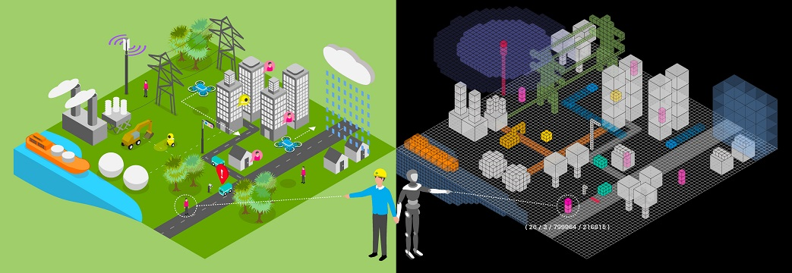

# ウラノスGEX 4次元時空間情報基盤用 共通ライブラリ(JavaScript版)


## 概要
- 任意の座標を空間IDに変換するライブラリです。
- 空間ID仕様については以下のリンクを参照して下さい。
<!--[Digital Architecture Design Center 4次元時空間情報基盤 ガイドライン](https://www.ipa.go.jp/digital/architecture/project/autonomousmobilerobot/3dspatial_guideline.html)-->
<p><a href="https://www.ipa.go.jp/digital/architecture/project/autonomousmobilerobot/3dspatial_guideline.html" target="_blank">Digital Architecture Design Center 4次元時空間情報基盤アーキテクチャガイドライン（β版）</a></p>

## 共通ライブラリ利用方法
1. npmインストール
```
npm install git+https://github.com/ouranos-gex/ouranos-gex-lib-for-JavaScript.git
```
1. モジュールのロード
```
import { Space } from 'ouranos-gex-lib-for-javascript'
```

## 注意事項
* ライブラリの入力可能な緯度の最大、最小値は「±85.0511287798」とします。
* 精度レベルの指定範囲は、0から35とします。
* 経度の限界値は±180ですが、180と-180は同じ個所を指すこととZFXY形式のインデックスの考え方により、180はライブラリ内部では-180として扱われます。(180の入力は可能とします。)

## 問合せ及び要望に関して
- 現在、本リポジトリへのIssue（提案）及びPull Request（修正依頼）の受付を一時的に停止しています。
- 問合せ受付を再開するまでの間、お返事することができませんので予めご了承ください。問合せ受付を再開する際にこちらのREADMEの表記を修正いたします。

## ライセンス
- 本リポジトリはMITライセンスで提供されています。
- ソースコードおよび関連ドキュメントの著作権は株式会社Geoloniaに帰属します。

## 免責事項
- 本リポジトリの内容は予告なく変更・削除する可能性があります。
- 本リポジトリの利用により生じた損失及び損害等について、いかなる責任も負わないものとします。

## 詳細仕様

### コンストラクタ
新しい空間オブジェクトを返します。
```
Space( input, zoom? )
```
#### input
座標及び高度または空間 ID を以下のフォーマットで指定することができます。
* LngLatWithAltitude: 緯度経度及び高度を含むオブジェクト。（例: `{ lng: number, lat: number, alt?: number }`）
* ZFXYTile: ZFXY（3次元タイル番号）を示す文字列。（例: `/15/6/2844/17952`）
* TileHash: ZFXY をハッシュ化した値。（例: `100213200122640`）
#### zoom
ズームレベル（分解能）を整数で指定することができます。  
この引数は省略も可能で、デフォルトは `25` です。
### 補助コンストラクタ
```
Space.boundingSpaceForGeometry( geometry, minZoom? )
```
`geometry` に渡された GeoJSON の Geometry オブジェクトに対して、最小分解能（ズームレベル）での空間IDを返す。
`minZoom` が指定している場合は、より少ない分解能（ズームレベル）の空間IDが作られるにしても、 `minZoom` での空間IDを返す。
```
Space.spacesForGeometry( geometry, zoom )
```
`geometry` に渡された GeoJSON の Geometry オブジェクトに対して、その Geometry と指定の `zoom` での分解能（ズームレベル）の空間IDの共通集合を配列として返す。
### メソッド
`Space` のメソッドのドキュメンテーションは下記となります。
#### `.center`
* 現在の空間オブジェクトの中央点 (3Dの `{lng: number, lat: number, alt: number}` 型)
#### `.alt`
* 現在の空間オブジェクトの最低高さ (floor)
#### `.zoom`
* 現在の空間オブジェクトのズームレベル（分解能）
#### `.zfxy`
* 現在の空間オブジェクトが表現している ZFXY を ZFXYTile 型 (`{ z: number, f: number, x: number, y: number }`)
#### `.id`, `.tilehash`
* 現在の空間オブジェクトが表現している ZFXY の tilehash の文字列
#### `.zfxyStr`
* 現在の空間オブジェクトが表現している ZFXY を URL のパス型に変換したもの
#### `.up(by?: number)`

* パラメータがない場合は、現在の空間オブジェクトのひとつ上の空間オブジェクトを返す
* パラメータが指定されている場合は、その個数分の空間オブジェクトを配列で返す
#### `.down(by?: number)`

* パラメータがない場合は現在の空間オブジェクトのひとつ下の空間オブジェクトを返す
* パラメータが指定されている場合は、その個数分の空間オブジェクトを配列で返す
#### `.north(by?: number), .east(by?: number), south(by?: number), .west(by?: number)`

* パラメータがない場合は、現在の空間オブジェクトの隣のオブジェクトを返す
* パラメータが指定されている場合は、その個数分の空間オブジェクトを配列で返す
#### `.move(by: Partial<Omit<ZFXYTile, 'z'>>)`
* 現在の空間オブジェクトから相対的な新しいオブジェクトを返す。 `by` は少なくとも `x, y, f` の一つ以上を含めてください
```
space.move({x: 1, y: 5, f: -1})
```
上記の例の場合では、返り値は西1マス、北5マス、下1マスにある空間オブジェクト
#### `.surroundings()`

* 現在の空間オブジェクトのまわりにあるすべての空間オブジェクトを配列で返す。
#### `.parent(atZoom?: number)`
* 現在の空間オブジェクトから、分解能（ズームレベル）を `atZoom` のズームレベルまで下げる。デフォルトでは1段階下げます。
#### `.children()`
* 現在の空間オブジェクトから、分解能（ズームレベル）を一つ上げて、そこに含まれるすべての空間オブジェクトを返す。
#### `.contains()`
* 指定された緯度経度が、指定されたボクセル内に含まれるかどうかを判定して bool 値を返す。
#### `.vertices3d()`
* 現在の空間オブジェクトの3Dバウンディングボックスを作る8点の座標を配列として返す。
